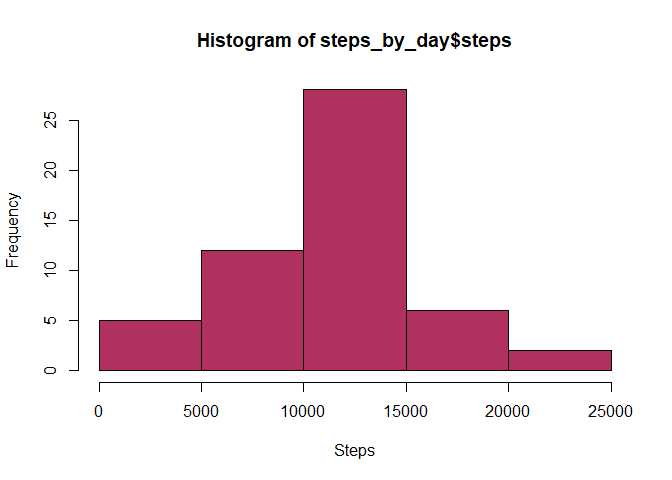
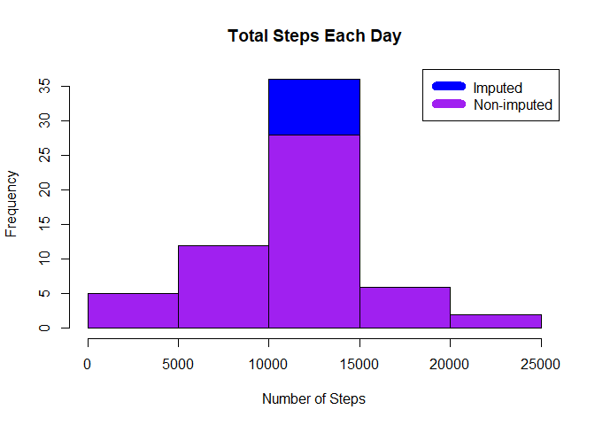
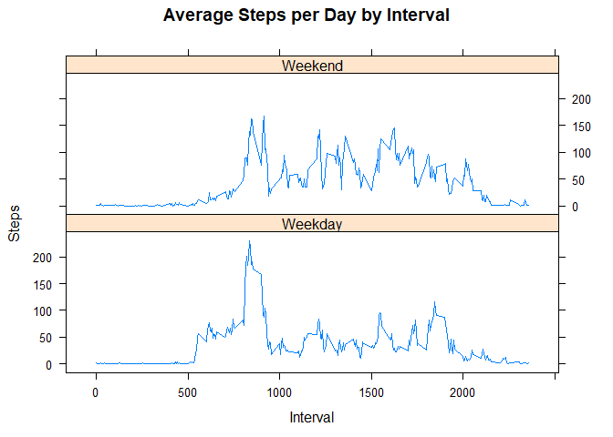

## Loading and preprocessing the data

```r
activity <- read.csv("activity.csv")
activity$date <- as.Date(as.character(activity$date))
head(activity)
```

```
##   steps       date interval
## 1    NA 2012-10-01        0
## 2    NA 2012-10-01        5
## 3    NA 2012-10-01       10
## 4    NA 2012-10-01       15
## 5    NA 2012-10-01       20
## 6    NA 2012-10-01       25
```

## What is mean total number of steps taken per day?

```r
steps_by_day <- aggregate(steps ~ date, activity, sum)
head(steps_by_day)
```

```
##         date steps
## 1 2012-10-02   126
## 2 2012-10-03 11352
## 3 2012-10-04 12116
## 4 2012-10-05 13294
## 5 2012-10-06 15420
## 6 2012-10-07 11015
```

```r
hist(steps_by_day$steps,xlab="Steps",col="maroon")
```

<!-- -->

```r
mean(steps_by_day$steps)
```

```
## [1] 10766.19
```

```r
median(steps_by_day$steps)
```

```
## [1] 10765
```

## What is the average daily activity pattern?

```r
steps_by_i <- aggregate(steps ~ interval, activity, mean)
plot(steps_by_i$interval,steps_by_i$steps,type="l",xlab="Interval",ylab="Steps")
```

<!-- -->

```r
m <- steps_by_i[which.max(steps_by_i$steps),1]
```

## Imputing missing values

```r
missingvalues <- sum(is.na(activity))
StepsAverage <- aggregate(steps ~ interval, activity,mean)
f <- numeric()
for (i in 1:nrow(activity)) {
  obs <- activity[i, ]
  if (is.na(obs$steps)) {
    steps <- subset(StepsAverage, interval == obs$interval)$steps
  } else {
    steps <- obs$steps
  }
  f <- c(f,steps)
}
new_activity <- activity
new_activity$steps <- f
StepsTotalUnion <- aggregate(steps ~ date, new_activity, sum, na.rm = TRUE)
hist(StepsTotalUnion$steps, main = paste("Total Steps Each Day"), col="blue", xlab="Number of Steps")
hist(steps_by_day$steps, main = paste("Total Steps Each Day"), col="purple", xlab="Number of Steps", add=T)
legend("topright", c("Imputed", "Non-imputed"), col=c("blue", "purple"), lwd=10)
```

<!-- -->

```r
rmean <- mean(StepsTotalUnion$steps)
rmean
```

```
## [1] 10766.19
```

```r
rmedian <- median(StepsTotalUnion$steps)
rmedian
```

```
## [1] 10766.19
```

```r
dme <- mean(StepsTotalUnion$steps) - mean(steps_by_day$steps,na.rm = T)
dme
```

```
## [1] 0
```

```r
dmed <- median(StepsTotalUnion$steps) - median(steps_by_day$steps)
dmed
```

```
## [1] 1.188679
```

## Are there differences in activity patterns between weekdays and weekends?

```r
weekdays <- c("Monday", "Tuesday", "Wednesday", "Thursday", 
              "Friday")
new_activity$wowd = as.factor(ifelse(is.element(weekdays(as.Date(new_activity$date)),weekdays), "Weekday", "Weekend"))
StepsTotalUnion <- aggregate(steps ~ interval + wowd, new_activity, mean)
library(lattice)
xyplot(StepsTotalUnion$steps ~ StepsTotalUnion$interval|StepsTotalUnion$wowd, main="Average Steps per Day by Interval",xlab="Interval", ylab="Steps",layout=c(1,2), type="l")
```

<!-- -->
